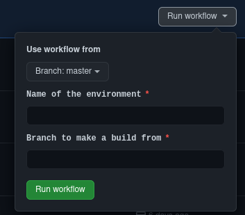

# DhiffieChat

End-To-End Encrypted Private Chat - Now with ephemeral key pairs!

I built this app because I wanted to play with encryption and experiment with building low cost automated cloud
environments. The Clients do not trust the server, and a worst case server compromise event would only leak the 
last 14 days of metadata

---

### Architecture, Automation, and Deploying Environments

Due to the cost constraints I placed on myself, I wouldn't be able to use managed relational databases or provisioned
server instances.

The backend is built with AWS lambda, dynamoDB, s3. All of these are pay as you go, which is perfect because I don't really
expect anybody to use this anyway `¯\_(ツ)_/¯`

Creating new environments or modifying existing environments is automated through `Terraform`, and AWS costs are about
$0.06/month during development.

Terraform helps automate creation, configuration, or execution of the following resources and tasks.

* AWS Gateway
* AWS lambda functions
* AWS DynamoDB Tables
* AWS S3 Buckets
* Generating Credentials
* Configuring Access and Permissions
* Generating Config files for the app to connect to new environments

---

### Android Automation

* The Config files to connect to the server are automatically generated when a new environment is created.

* CI workflow to make builds for any specified branch/environment. Provides easy download access for QA. Prod builds generated
  from the master branch also generate a GitHub release.

* All CI builds are automatically tagged with a generated version name that makes it easy to see how the build was
  generated, and where in the history of repository.

---

### Security

Every user generates an RSA keypair which is used to securely identify themselves. This RSA keypair is used to sign 
ephemeral Diffie-Hellman public keys so that when someone sends/receives a message, they know that the ephemeral keypair 
belongs to user that claims to have generated it. Since ephemeral key pairs are used, compromises of old keys do not 
allow new messages signed with new keys to be decrypted. A new ephemeral keypair is used for each message.

Every user provided piece of data is encrypted before it leaves the device. The encryption process uses a shared key
derived from a Diffie-Hellman key exchange, so the server is never aware of the credentials required to decrypt the
data. With the shared secret, both users are able to encrypt and decrypt the AES encrypted message shared between them

To add a contact you must exchange QR codes which contains the user's `alias` as well as a hash of their RSA public
key, which is used to identity themselves. The `alias` is also never shared with the server.

### Other Ways your data is kept private and protected

* On Android the Local database is encrypted with SQLCipher. The DB password is randomly generated on first launch and
  is encrypted within Android's `Trusted Execution Environment` where the private key for the DB password is held

* For any authenticated network request the app generates a token containing an expiration time in the near future. This
  token is signed with the RSA identity keypair. The server code uses the token, and the users public key to 
  authenticate the network request.

* Any uploaded media is stored as AES encrypted data in s3, where after 14 days the data is automatically deleted.
  The user provided encrypted text is also automatically deleted from DynamoDB after 14 days

---
